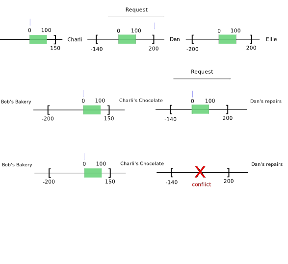
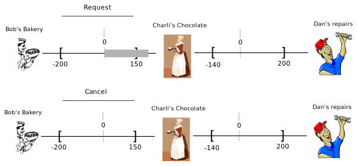

+++
title = "Design of Offset account book"
description = "Thoughts about the design of the Offset account book"
date = 2021-02-17
+++

This post is about to describe some thoughts I had regarding
the design of the Offset account book. Just in case this is your first time hearing
about Offset, [Offset](https://www.offsetcredit.org) is a decentralized
infrastructure allowing trading without money. Members can trade with each
other on the basis of credit accounting. To save some energy for both the
readers and me, Offset is not a blockchain, and it will not make you rich.

I haven't updated here for a while. Recently a friend asked me what I was
working on, and my reply was that I was having some problems with the design of
the Offset account book. "Well, what's so difficult about designing a phone
book?" was the immediate reaction. I tried to explain, but the best I could do
in the 2 minutes I had was to mumble something about the fact that Offset is
decentralized, transactions are asynchronous, things might get cancelled, etc. 
Obviously this was not enough to convince my friend, but this got me thinking,
maybe I need to write this all down, to get a better understanding myself of
what is so difficult with designing Offset's account book.

# Motivation

A good start might be to explain why I want to have an account book in the
first place. The first version of Offset has a very simple mobile app that
allows payments using the Offset network. One repeating feedback I received
from users of Offset v1 was that once they received a payment successfuly,
there was no record showing that a transaction ever happend. This occured
because indeed Offset v1 did not save any record for any past transaction! 

Offset v1 saves only the final balance against every friend. The mobile app
goes one step forward and keeps track of succesful (sent) payments by keeping
a cryptographic receipt, but as this information is only saved in the mobile
app, it can not be synchronized between multiple devices that connect to the
same Offset node.

From the feedback I realized that people want to know their history of
transactions. As I tried to dig deeper I realized some of the reasons behind
this feature request. Some people wanted to obtain better understanding of
their own earnings or spendings. Others mentioned that they would like to have
neat records to help them do their taxes, having a convincing and auditable
account book.

In the spirit of the rest of Offset's design, this feature should never
compromise user's privacy. A user transactions' history will only be saved
inside his own node, and can be deleted if the user wanted to. There should
also be a way to cancel this feature altogether, for users that do not want to
ever remember past transactions.


# Requirements

The only account book I see regularly is my own account book at my bank's
website. It looks somewhat like this:


```
Date       | Balance |  Change | Description 
===========+=========+=========+==================
10.02.2021 | +20000  |   -100  | Supermarket
12.02.2021 | +29000  |  +9000  | Salary
13.02.2021 | +28500  |   -500  | Electricy bill
15.02.2021 | +28400  |   -100  | Water bill
```

Every row in the table describes a transaction that took place at a certain
date. Balance denotes the balance right after the transaction took place. So in
the table above: `20000 + 9000 = 29000`, and `29000 - 500 = 28500`. The change
column is either positive (if I received money), or negative (if I sent money).
The description column is a very short textual description of the transaction.

I would like to have something as similar as possible to this account book for
Offset. However, due to the nature of Offset having an exact copy of this
account book design might not be easily acheived. Hence, I would like to
somehow extract the core characteristics of this simple account book, and at
least somehow satisfy those characteristics.

One of the most important characteristic of the above simple account book I
would like to imitate is what I call the *locality principle*. Wherever you are
at the account book, you can audit the balance by looking the the previous
transaction's balance, add the change from the new transaction, and be able to
calculate the balance of the next row. This applies even if you are given a
partial account book, for example, only beginning from a certain date.

The other problem I would like the account book to solve is to somehow allow
a third party (Like a tax collecting entity) to somehow audit the account
book, or even cross audit account books of different people that traded with
each other [^1].

# Core Offset protocol

To better understand how to create a sound account book for Offset, some
understanding about how Offset works is required. I will try to outline the
main credit related parts, abstracting away all the technical details of low
level communication, encryption etc.

Offset allows trading on the basis of credit accounting. The basic component of
the Offset protocol is a **pair of friends**. Offset friends give certain
amount of credit to each other. A relationship between two Offset friends is
called mutual credit. 


Offset lets any user pay another user along of chain of friendships. This
allows users to trade only using credit accounting, without using the
traditional money systems. The following two images show an example for payment
along a chain of Offset friendships, where Bob pays Dan through Charli.

Status before payment:


Status after payment:


If Offset was built using a single centralized database, invoking such chain
transactions could have been trivial. However, Offset is a decentralized
system, and the mutual credit between any two users is only saved on the
devices of those two users. Therefore, performing a chain payment is a bit more
tricky. For example, what can we do if some user along the chain decides to not
forward the transaction, or maybe he becomes offline?

Offset attempts to solve this problem in a decentralized way using the core
Offset protocol. At its core, the **Offset protocol is made of three messages:
Request, Response and Cancel**. Those messages are sent between Offset friends.

Let's revisit the payment drawn earlier, this time with finer details of the
Offset protocol taking place:




Order of events:

- Bob sends Charli a Request message.
- Charli sends Dan a Request message.
- Dan sends Charli a Response message.
- Charli sends Bob a Response message.

When a Request message is sent, credits are frozen in the mutual credit channel
between the two parties. For example, when Bob sent Charli a Request message,
the mutual credit channel between Bob and Charli has frozen 100 credits. Frozen
credits can not be used. They are waiting for the transaction to be completed
or cancelled. 

When a Respnose message is sent, the corresponding frozen credits are released
and transferred to the relevant party. For example, when Charli sent Bob the
last Response message, the 100 frozen credits were unfrozen, and the balance
between Bob and Charli changed to be +100 in favor of Charli.

Frozen credits are created by sending a Request message. Frozen credits can
only be unfrozen by:

- Sending a Response message. In this case the unfrozen credits are transferred
    to the party that received the original Request.
- Sending a Cancel message. In this case the frozen credits are erased.

Example for a Request being cancelled:



In the example above, Bob tried to send 170 credits all the way to Dan.
However, the mutual credit between Bob and Charli did not have sufficient
capcity (Because Charli has set up a credit limit of 150). Therefore instead of
forwardin the Request to Dan, Charli sends back a Cancel message to Bob. This
Cancel message has the effect of erasing the frozen credits. The balance
between Bob and Charli is left unchaged, and Bob is notified that the
transaction has failed.

Some rules to remember:

- Every Response or Cancel message must correspond to a previously sent Request
 in the opposite direction. The correspondence is done using a `request_id`
- It is not possible to return both a Response and Cancel messages for a
    Request message. It must be exclusively one of Response or Cancel, but not
    both.
- Every Request message is expected to eventually be countered by a Response or
    Cancel message. Otherwise, the credits are kept frozen and can not be used.


Essentially, the payment process can be summarized as two stages:

1. A Request is sent from the buyer to the seller, freezing the required
   credits along the chain.

2. A Response is sent from the seller all the way back to the buyer, claiming
   all the frozen credits.

The core protocol gives the intermediate nodes along the chain an incentive to
forward the protocol messages. An intermediate node loses credits when he
receives the Response message, and only earns back his credits when he keeps
forwarding back the Response message.


# Payments and Invoices


[^1]: Offset will allow the user to produce an account book, but will never
  send this account book anywhere without explicit user's request.
