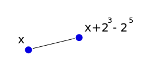
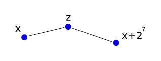

+++
title = "Multi Named VDHT Routing"
description = ""
date = 2015-10-17
+++

## Abstract

We are given a connected mesh network of $n$ nodes, where each node has a unique
name from the range of $[0,2^l)$. We assume that $n \leq 2^l$. Every node is
directly connected to a few other nodes.

We present an iterative distributed algorithm: MIterF, that allows each node $x$
to maintain remote contact with a few key nodes. The remote contact with those
key nodes allows efficient greedy routing of messages between any two nodes: At
each step the message is sent to a remote contact with a name that is closest to
the destination.

Given that the mesh network is connected, We prove that the presented iterative
distributed algorithm MIterF always converges to a solution that allows
efficient greedy routing.

## Previous attempts

In [Experimenting with Virtual DHT
Routing](./research/exp_virtual_dht_routing/index.md)
we have presented an iterative distributed algorithm that allows each node $x$
to maintain contact with a few key nodes that are close to $x \pm 2^t$. We used
experiments to show that this algorithm can work in some cases, but we didn't
provide any rigorous proof for those claims.

In [About cycles in stationary states of VDHT routing
algorithms](./research/vdht_cycles_rounds/index.md)
we presented a slightly different iterative distributed algorithm, IterF, that
also allows each node $x$ to maintain contact to a few key nodes that are close
to $x \pm 2^t$. 

We have managed to prove that after IterF converges, we end up with possibly a
few disjoint sets of nodes (OneRound Theorem). In each such set $S$, for every
two nodes $a,b \in S$ it is possible to route messages efficiently between $a$
and $b$. However, we do not know how to efficiently route messages between nodes
from different disjoint sets.

We present here a modification to the IterF algorithm, MIterF (Multi named
IterF), which is proven to converge to just one set of nodes $S$, such that for
every two nodes $a,b \in S$ it is possible to route messages efficiently between
$a$ and $b$. This improvement comes at the cost of having every node maintain
paths to more nodes.

## Nodes that must share a cycle

Recall that the IterF algorithm eventually converges to a stationary state. Also
recall that in a stationary state of the IterF algorithm the nodes are divided
to disjoint cycles (of one round each). Our analysis didn't show which node will
end up at which cycle.

We will now discuss a few cases of pairs of nodes who we know for sure will end
up on the same cycle at a stationary state of IterF.

**Lemma (SameCycleA):** If $x$ is connected directly to a node $y$ of the form
$y = \pm 2^k \pm 2^t$ where $0 \leq k,t < l$, then $x$ and $y$ must be on the
same cycle on any stationary state of the IterF algorithm.

An example for a case of SameCycleA:

In this example, we know that the two nodes $x$ and $x + 2^3 - 2^5$ will end up
on the same cycle.

**Proof:** For readability reasons we will only deal with the case of $y = x +
2^k + 2^t$. The other cases can be proved in the same way, but with inverted
plus and minus symbols.

Assume a stationary state of the IterF algorithm.
We first show that $\overleftarrow{(x + 2^k + 2^t)_{-2^k}} =
\overleftarrow{x_{2^t}}$. Suppose that $\overleftarrow{(x + 2^k + 2^t)_{-2^k}}
\neq \overleftarrow{x_{2^t}}$. 

Then we can distinct between two cases:

*Case 1:* $\overleftarrow{(x + 2^k + 2^t)_{-2^k}} \in
(\overleftarrow{x_{2^t}},x+2^t]$. In that case in the next iteration of the
algorithm $x$ will update $\overleftarrow{x_{2^t}}$ to be $\overleftarrow{(x +
2^k + 2^t)_{-2^k}}$, because it is closer to $x+2^t$ from the left (clockwise).
This is a contradiction to the stationary state of IterF.

*Case 2:* $\overleftarrow{(x + 2^k + 2^t)_{-2^k}} \in
(x+2^t,\overleftarrow{x_{2^t}})$. In that case in the next iteration of the
algorithm $y = x + 2^k + 2^t$ will update $\overleftarrow{y_{-2^k}}$ to be
$\overleftarrow{x_{2^t}}$, because it is closer to $x+2^t$ from the left
(clockwise). This is a contradiction to the stationary state of IterF.

Thus it must be true that $\overleftarrow{y_{-2^k}} = \overleftarrow{x_{2^t}}$.

By the Locality lemma (see [About cycles in stationary states of VDHT routing
algorithms](./research/vdht_cycles_rounds/index.md))
there is a direct path between $x$ and $\overleftarrow{x_{2^t}}$, and so $x$ and
$\overleftarrow{x_{2^t}}$ must be on the same cycle. In the same way, there is a
direct path between $\overleftarrow{y_{-2^k}}$ to $y$, therefore
$\overleftarrow{y_{-2^k}}$ and $y$ must be on the same cycle.

As $\overleftarrow{y_{-2^k}} = \overleftarrow{x_{2^t}}$, we conclude that $x$
and $y$ must be on the same cycle. **QED**

**Lemma (SameCycleB):** If $x$ is connected directly to a node $y$, which is
connected directly to a node $z$ of the form $z = x \pm 2^k$, where $0 \leq k <
l$, then $x$ and $z$ must be on the same cycle on any stationary state of the
IterF algorithm.

An example for a case of SameCycleB:

In this example, we know that the two nodes $x$ and $x + 2^7$ will end up
on the same cycle. (The value of $z$ does not matter).

**Proof:**
For readability reasons we will only deal with the case of $z = x + 2^k$. The
other case could be proved in a similar way.

Assume a stationary state of the IterF algorithm. We first show that
$\overleftarrow{x_{2^k}} =
x + 2^k$. Suppose that $\overleftarrow{x_{2^k}} \neq x + 2^k$. Then in the next
iteration $y$ will tell $x$ about $z = x + 2^k$, and $x$ will update
$\overleftarrow{x_{2^k}}$ to be $x+2^k$, because it is closer to $x+2^k$ from
the left (It has distance 0!). This is a contradiction to the stationary state
of IterF. Therefore we conclude that $\overleftarrow{x_{2^k}} = x + 2^k = z$.

By the Locality lemma there is a direct path between $x$ and
$\overleftarrow{x_{2^k}} = z$. Therefore there is a direct path between $x$ and
$z$, and so $x$ and $z$ must be on the same cycle. **QED**.

The two lemmas we have proved above tell us something about which nodes should
end up on the same cycle, but they are far from complete in describing the
structure of the cycles of a stationary state of IterF. For Example, currently
we don't know to say much about which nodes will not be on the same cycle.

## On the applicability of SameCycleA and SameCycleB

Given the two lemmas above (SameCycleA and SameCycleB), one might wonder how
often it is possible to apply those lemmas and conclude that all nodes will end
up on the same cycle.

We will perform a very hand wavy calculation to get a feeling for this
likelihood.

For a specific node $x$ there are at most $(2l)^2$ possible combinations of $x
\pm 2^k \pm 2^t$ for $0 \leq k,t < l$, and at most $2l$ possible combinations of
$x \pm 2^k$.

We assume that every node in the network is directly conected to at most
$\log(n)$ other nodes.

*For the nodes directly connected to $x$*: Assume that those $\log(n)$ nodes were
chosen randomly. About $\log(n) \cdot \frac{(2l)^2}{n}$ out of these nodes will
be of the form $x \pm 2^k \pm 2^t$. 

$$\log(n) \cdot \frac{(2l)^2}{n} = \frac{\log(n)\cdot (2l)^2}{n} \leq \frac{l\cdot
(2l)^2}{n} = \frac{4l^3}{n}$$

Hence for $n > 4l^3$ we expect that with high probability some node $z$ will not
have any direct connections on the network of the form $z \pm 2^k \pm 2^t$.

*For nodes that are two hops from $x$*: There are about ${\log(n)}^2$ such
nodes. Assume that they were chosen randomly. About ${\log(n)}^2 \cdot
\frac{2l}{n}$ out of these nodes will be of the form $x \pm 2^k$.

$${\log(n)}^2 \cdot \frac{2l}{n} = \frac{{2l}\cdot{\log(n)}^2}{n} \leq
\frac{2l\cdot l^2}{n} = \frac{2l^3}{n}$$

Hence for $n > 2l^3$ we expect that with high probability some node $z$ will not
have any node two hops from him of the form $z \pm 2^k$.

As a final rough conclusion, we believe that for large enough values of $n$, for
example $n \gg 4l^3$, we expect that for some nodes non of the lemmas SameCycleA
or SameCycleB will be applicable. 

We might need something else to be able to prove the convergence of IterF to a
single cycle.

## Multi Naming

For every two nodes $x$ and $y$, we say that $x$ and $y$ are **FriendsA** if $y$
is of the form $y = x \pm 2^k \pm 2^t$. (A special case would be $y = x \pm
2^k$). Note that this property is symmetric (If $x$ and $y$ are FriendsA, then
$y$ and $x$ are FriendsA). We will denote that $x$ and $y$ are FriendsA by $x
\sim y$.

Consider some two directly connected nodes $x,y$ on a mesh network.  If $x \sim
y$ then by the SameCycleA lemma we can show that $x$ and $y$ will end up on the
same cycle. However, if $x \nsim y$, we don't have anything meaningful to say.
Unfortunately, in most cases we will have $x \nsim y$.

Consider that case of $x \nsim y$. Imagine for a moment that there were some
extra nodes between $x$ and $y$: $x = z_1,z_2,\dots,z_r = y$ such that $z_j \sim
z_{j+1}$ for $1 \leq j < r$. In that case we conclude that $z_j, z_{j+1}$ are on
the same cycle for $1 \leq j < r$, and therefore $x$ and $y$ must end up on the
same cycle on every stationary state of the IterF algorithm.

In the picture: Before and after adding imaginary extra nodes between $x$ and
$y$.

In the real network there are no such extra nodes, but nothing prevents $x$
and $y$ to pretend the existence of those nodes. $x$ will play the role of
$z_1,z_2,\dots,z_{\left\lceil r/2 \right\rceil}$ in the network, and $y$ will
play the role of $z_{\left\lfloor r/2 \right\rfloor},\dots,z_r$ in the network.

We want to know how large can $r$ be. We know that $0 \leq x,y < 2^l$, hence
both $x$ and $y$ could be written using at most $l$ bits. We want to get from
$x$ to $y$ using small changes of the form $\pm 2^k \pm 2^t$. Every small change
introduces another imaginary extra node.

We start from $z_1 = x$. We can reach $y$ by changing at most two bits at a
time. $x$ and $y$ will usually differ at about $l/2$ bits. We assume that worst
case, where $x$ and $y$ differ at $l$ bits. Hence we will need at most
$\left\lceil l/2 \right\rceil$ imaginary nodes. (At most two bits in every small
change. We add the ceiling operator for the case of odd $l$). We conclude that
$r \leq \left\lceil l/2 \right\rceil$.

Hence each of $x,y$ will play the role of at most $\left\lceil l/4 \right\rceil$
extra imaginary nodes.

We can add imaginary extra nodes between every two nodes $a,b$ in the network
such that $a \nsim b$. A node $z$ that is directly connected to $q$ nodes will
have to play the role of at most $q\cdot \left\lceil l/4 \right\rceil$ nodes.
This means that every node will maintain remote paths to about
$q\cdot(l/4)\cdot(4l) = ql^2$ nodes.

Note that originally, every node had to maintain remote paths to about $2l$
nodes, which is much less. 

Adding the extra imaginary nodes should not make message routing less efficient,
because routing messages between imaginary nodes does not cost significant time.
The modification does require, however, that nodes will maintain more "fingers":
More paths to remote nodes. The more direct connections a node has, the more
remote connections he will have to maintain.

In the picture: Before and after adding imaginary extra nodes between all pairs
of connected nodes. The imaginary nodes are shown with lighter color that
matches the color of the real node who plays their role in the algorithm.

## Practicality issues

*Regarding Network performance:* We require every node to maintain remote
paths to about $ql^2$ nodes. Assuming that a node $x$ has $5$ direct
connections, and we pick $l=128$, this results in $81920$ ($\approx 2^{15}$) which
is a lot of connections. I think that this number is on the edge of what is
practical these days with communication. I believe that there is a way to
slightly improve the MIterF algorithm to acheive more realistic numbers.

*Who gets to pick the names for the nodes?* This is a major question, as name
collisions (two nodes with the same name) could disrupt correct routing. Also,
who gets to pick how the path of imaginary FriendsA nodes between two nodes
$x,y$ will be constructed? Where will the names come from?

We solve the problem of name collisions by using a large namespace. We pick a
large $l$, for example $l=128$. If names are chosen randomly, the probability of
a name collision should be very small (Even between the paths of imaginary
FriendsA nodes).

*Security: Will this system survive a strong adversary?* Not in its current
form. We need to add some mechanisms to avoid the following possible attacks:

-   Eclipse attack: An attacker might be able to obtain many names that are
close to a node $x$ in the namespace, and thus absorb all the messages that
should arrive at $x$. Therefore $x$ will not be able to receive any messages.
The question of who gets to pick the names is tightly related to preventing
these kinds of attacks.

-   [Denial of Service](https://en.wikipedia.org/wiki/Denial-of-service_attack):
A node might be able to send many messages and flood the network. A node might
also decide to stop routing certain messages, and thus disrupt routing of
messages in the network.

## Further questions

We know that the MIterF always converges to a stationary state where all the
nodes are in the same cycle (And the cycle has only one round). We still haven't
answered the following questions:

-   How long does it take for MIterF to converge? I think that the answer is
something like $O(c\cdot diam(G))$, where $c$ is some constant and $diam(G)$ is the
diameter of the network (The longest distance between two nodes), but I don't
know of a proof for this.

-   How long are the paths that we get from each node $x$ to his "fingers"? For
example, how long would be the path from $x$ to $\overleftarrow{x_{2^t}}$, as
calculated by MIterF? How does it compare to the length of the shortest path in
the network between $x$ and $\overleftarrow{x_{2^t}}$? Currently I have no idea
about how to estimate the length of paths calculated by MIterF. Note that this
question might be related to the shape of the network.

## Summary

We presented MIterF, an iterative distributed algorithm that builds a setting
for efficient routing of messages between nodes. Assuming that the network is
connected, we proved that MIterF always converges to stationary state that
allows efficient routing between all pairs of nodes in the network.

During the execution of the algorithm every node $x$ that has direct connections
to $q$ nodes must maintain remote paths to at most $ql^2$ nodes.

