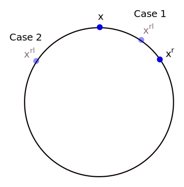
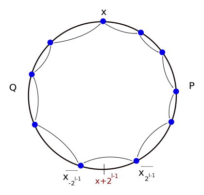

+++
title = "About cycles in stationary states of VDHT routing algorithms"
description = ""
date = 2015-10-15 
+++

## Abstract

We are given a connected network (graph) of named nodes. We discuss an iterative
distributed algorithm that allows each node in the graph to find a path to
several other key nodes. Those paths later allow efficient routing of messages
between any two nodes in the network.

We discuss one specific iterative distributed algorithm (IterF). We show that it
converges for every given connected graph after a finite amount of steps, and we
discuss some properties of its output.

It turns out that the IterF algorithm returns one or a few disjoint sets of
nodes. Each of those sets has a structure that allows efficient routing between
the nodes inside that set. (But not to any node outside that set).

## Intro

In [Experimenting with Virtual DHT Routing](
./research/exp_virtual_dht_routing/index.md)
we have discussed an idea of routing using a Virtual DHT. 
follows: Every node in a mesh graph is given a random number from a "closed
ring", and the nodes somehow try to find each other, iteratively. 

We think about the following simplified routing problem: We are given a
connected graph of $n = 2^l$ vertices. Each verticle is given a number between
$0$ and $2^l - 1$ (Every two vertices are given different numbers). This
assignment of names is arbitrary, and we have no control over it. The vertices
of this graph represent the nodes in a mesh network. 

We want a distributed algorithm that allows node $x$ to find a path to some key
nodes: $x-2^i , x+2^i$ for $0 \leq i < l$. We know that this should be possible,
because the graph is connected, and those paths exist.

Given that every node of number $x$ knows paths to nodes of numbers $x-2^i,
x+2^i$, every node $y$ should be able to send a message to any other node $z$ in
the network using the [greedy routing algorithm of the Chord
DHT](@/research/dht_intro/index.md): In every
iteration send the message to the closest known node to the destination.

## Running the Basic Algorithm

We begin with a basic algorithm, where every node $x$ tries to find paths to the
adjacent nodes on the circle: $x-1$ and $x+1$. It will not give us an efficient
routing solution, but it will teach us something about the convergence of
similar algorithms.

Every node $x$ remembers at all times paths to two nodes: A node $x^l$ (Read:
$x$'s left) that minimizes $d(x^l,x-1)$, and a node $x^r$ that minimizes $d(x+1,x^r)$.
Recall that $d(a,b)$ is the clockwise distance between $a$ and $b$. Hence, In
other words, $x$ tries to find nodes that are closest to him clockwise and
counter-clockwise.

We describe here the algorithm, as executed by one node $x$. The algorithm takes
as arguments the direct connections of $x$ to other nodes in the network. The
set of the direct connections of $x$ is called DirectCons.

Macro $Known$: $DirectCons \cup \{x^l,x^r\} \cup TempRecipients$

- Initialization($DirectCons$):

    1.  Set $x^l, x^r$ to be the most suitable nodes from the set $DirectCons \cup
    \{x\}$.
    2.  $TempRecipients \leftarrow \emptyset$

- On receival of Update message with set $S$ from node $y$

    1. If $y \not\in Known$:

        1.1 Add $y$ to $TempRecipients$.

    2. Update $x^l$ and $x^r$ if better candidates were found inside $S \cup
    \{y\}$.

- On time tick:

    1. For every node $y \in Known$:

        1.1 Send $y$ an Update message with set $Known$.

    2. Set $TempRecipients \leftarrow \emptyset$

Experiments (Described in previous articles) have shown that the basic algorithm
does not always converge to a solution. That means: Sometimes a node $x$ will
not find $x-1$ and $x+1$, even after running the algorithm for many iterations.
It is also noticeable that after a while the state of network graph is
stuck: further iterations of the Basic Algorithm do not change the state. We
call such state a stationary state. It is interesting to understand what is the
state of the network graph at this point.

## Analyzing the operation of the Basic Algorithm

For every node $x$ we denote by $x^l$ ($l$ stands for left) the node closest to
$x$ counter-clockwise that $x$ knows of (That is not $x$). We denote by $x^r$
the node closest to $x$ clockwise that $x$ knows of (That is not $x$). 
(As a sanity check for understanding the notation, $x^l$ minimizes $d(x^l,x)$
between all nodes that were ever known to $x$)

We define the state of the algorithm to be $S = \{(x,x^l,x^r) | 0 \leq x < n\}$
It is the set of all choices of left and right node for all the nodes. We say
that a state $S$ is stationary if any amount of algorithm iterations will leave
$S$ unchanged.

We first show that every run of the Basic Algorithm indeed eventually converges
to a stationary state. 

**Lemma:** After a finite amount of iterations of the Basic Algorithm, the
algorithm converges to a stationary state.

**Proof:** For a state $S$ of the algorithm we define:
$$ e(S) := {\sum}_x {d(x+1,x^r) + d(x^l,x-1)}$$

$e$ is an energy function of the current state of the algorithm. It decreases in
every iteration of the algorithm (When some node $y$ updates his $y^l$ or $y^r$
to a better node). As the only possible values for $e$ are the natural numbers,
after a finite amount of iterations of the Basic Algorithm $e$ will not be able
to decrease anymore, and we will reach a stationary state of the algorithm. **QED**

**Lemma:** During a stationary state of the algorithm, for every node $x$ it
is true that $x^{rl} = x$ and $x^{lr} = x$. ($x^{rl}$ is a short notation for
$(x^r)^l$)

**Proof:** Let $x$ be some node. Consider $x^r$ and $x^{rl}$. First note that $x
\neq x^r$, because that would mean $x$ has no direct connections, and the graph
is not connected. Of a similar reason, $x^r \neq x^{rl}$.

Suppose that $x \neq x^{rl}$. Then we distinct between two cases:

*Case 1*: $x^{rl} \in (x,x^r)$. (This means: $x^{rl}$ is on the arc between $x$ and
$x^r$, clockwise). In the next iteration $x$ will send $x^r$ an Update message.
In the following iteration, $x^r$ will send $x$ an Update message. This message
will contain a path to $x^{rl}$. $x$ will then update $x^r$ to be $x^{rl}$. This
is a contradiction to the given stationary state.

*Case 2*: $x^{rl} \in (x^r,x)$. In the next iteration $x$ will send $x^r$ an
Update message, and $x^r$ will update $x^{rl}$ to be $x$. This is a
contradiction to the given stationary state.

Hence it must be true that $x = x^{rl}$. In the same way, we can conclude that
$x^{lr} = x$. **QED**

**Lemma:** During a stationary state of the algorithm, The function $h(x) :=
x^r$ (Or dually, $t(x) := x^l$) is [injective (one to
one)](https://en.wikipedia.org/wiki/Injective_function)

**Proof:** Let $x,y$ nodes such that $h(x) = h(y) = z$, for some node $z$.
By the previous lemma we conclude that $z^l = x^{rl} = x$ and $z^l = x^{rl} =
y$, therefore $x=y$. **QED**

## Division to cycles

We now begin from the node $x$, and apply the function $h$ over $x$ multiple
times. We get the nodes $x, h(x), h(h(x)), \dots$. There is a finite amount of
nodes, so we expect that eventually some element $h^k(x)$ ($h$ applied $k$ times
over $x$) will be equal to some other element $h^q(x), q < k$ that was already
on the series. Let's assume that $k$ is the smallest such integer.

But since $h$ is injective, $h^q(x) = h^k(x)$  means that $x = h^{k-q}(x)$. As
$k$ is the index of the first element that equals to a previously seen element,
we conclude that $q=0$ and so $h^k(x) = x$, the first element of the series.
Therefore the series $x, h(x), \dots, h^k(x)=x$ form a cycle. 

Note that this is a generic property of injective functions that operate inside
finite worlds.

If we now pick some node $z$ that has not appeared in the cycle of the node $x$,
and start applying $h$ many times, we will get another cycle. We can continue in
this fashion to divide all the nodes to different cycles.

## The possibility of multiple cycles

From the perspective of routing in the mesh, we don't want to have different
cycles for different nodes, as nodes from different cycles can not reach each
other. We hope that all the nodes end up on the same cycle.

To convince you that the possibility of disjoin cycles in our solution is real,
we will look at a counter example: An input graph that results in a set of
disjoint cycles after running our basic algorithm:

    7 - 5 - 3     8 -10 -12
    |       |     |       |
    9 -11 - 1 --- 6 - 4 - 2

If we run the Basic Algorithm it will converge after one iteration, and two
cycles will be formed: (7,5,3,1,11,9) and (8,10,12,2,4,6). As an example, $2$
will not be able to route messages to $3$, because it lives in another cycle.

For now we will forget about the disjoint cycles problem, and we will instead
try to understand how a cycle looks like.

## Multiple Rounds

Assume that somehow the algorithm has converged and only one cycle was formed.
(In other words: All the nodes ended up on the same cycle). Does that mean that
$x^r = x+1$ for every node $x$?

The answer is no. Let's build a counter example: An input graph for the
algorithm. The input graph is a cycle size $2^{3}$:

    0 - 2 - 4 - 6
    |           |
    7 - 5 - 3 - 1

The basic algorithm will converge on the first iteration. Each node will have
his right and left nodes to be exactly the right and left nodes on the graph.

The wanted result from the algorithm is that $x$ will have paths to $x-1$,$x+1$.
This obviously doesn't happen here, even though we did get one cycle that
contains all the nodes. 

The extra intuitive requirement that we miss here is that the cycle will
complete only "one round". We will now give a more rigorous definition for the
notion of round.

**Definition:** The amount of rounds of a cycle $C = (x, h(x), \dots ,
h^k(x)=x)$ is $R(C)$: the amount of local maximums (minimums) in the cycle. In
other words, it is the amount of $0 \leq i < k$ such that $h^i(x) < h^{i+1}(x) >
h^{i+2}(x)$. (Note that in a cycle, the amount of minimums is always the same as
the amount of maximums)

For example, in the cycle drawn above, $7$ and $6$ are local maximums. Dually,
$0$ and $1$ are local minimums.

**Lemma:** During a convergent state of the Basic Algorithm, If a cycle $C$
contains all the nodes from $0$ to $n-1$ and $R(C)=1$ then for every node $x$ in
the cycle, $h(x) = x+1$ (Modulo $n$)

**Proof:** $R(C)=1$ means that the cycle has only one local minimum and one
local maximum. Those must be the nodes $0$ and $n-1$. (Because they are also
global minimum and global maximum).

If $0$ is next to $n-1$ in the cycle ($h(n-1) = 0$ without loss of generality),
then the series $b_k := h^k(0)$, $0 \leq k < n$  is monotonically increasing.
$b_0 = 0$ and $b_{n-1} = n-1$, and also $(b_{i+1} - b_{i}) \geq 1$ for all $0
\leq i < n$.  Therefore it must be true that $(b_{i+1} - b_{i}) = 1$ for all $0
\leq i < n$.  This means that $h(x) = x+1$ (Modulo $n$) for every node $x$ in
the cycle.

Now assume that node $0$ is not next to $n-1$ in the cycle. We will soon see
that this is not possible under our assumptions.

Beginning from $0$, if we repeatedly apply the function $h$ we get the series
$0, h(0), h^2(0), \dots$. If we ever get $h^j(x) > h^{j+1}(x)$ for some $j$, it
means that $h^j(x) = n-1$, the only local maximum in this cycle. Hence from this
point in the cycle applying the function $h$ gives decreasing values, until it
returns back to $0$.

To summarize, we have seen that the cycle begins from $0$, increases until it
reaches $n-1$ and then decreases to $0$.

We observe the part of the cycle around the node $0$: $\dots,a,0,b,\dots$.
$a_l > a$, therefore $a_l$ is a better choice for left node for $0$. Hence in
the next iteration the node $a$ will tell the node $0$ about a path to $a_l$,
and $0_l$ will be $a_l$. This means that this state is not a convergent state of
the algorithm, which leads to a contradiction. (Note that we could not have
obtained this contradiction if $a=n-1$)

**QED**

We can conclude that we want an algorithm that will leave us with just one cycle
$C$ with $R(C) = 1$ that contains all nodes. 

Having all the nodes in one cycle of only one round allows efficient routing
using the following greedy method: On receipt of a message $m$ that is
designated to node $y$, choose a node $z$ with a name closest to $y$ out of all the
known nodes, and send the message to $z$ (through the maintained path). We
expect the message to arrive to its destination after at most $l$ such hops.

 
## Restricting the amount of rounds

We might be able to make some modification to our Basic Algorithm, to make sure
that each cycle $C$ of nodes we eventually get has just one round ($R(C)=1$).
This will not be enough to converge to a real solution, because we might have
more than one cycle, but it's a start.

### Adding two distant fingers

Intuitively, thinking about some node $x$ inside a cycle $C$ of more than one
round, the existence of multiple rounds could not be detected because $x$ does
not see far enough. He can only see his immediate connections to the left and
right, but he can not see what is going on on the other side of the cycle.

We could try to add two more "fingers": In addition to remembering $x^r$ and
$x^l$, $x$ will also remember paths to the following nodes:

- $x^L$ is the node that is closest (clockwise) to $x + 2^{l-1}$. In other
  words, it is the node $t$ that minimizes $d(t,x+2^{l-1})$, of all the nodes that
  $x$ has ever encountered.

- $x^R$ is the node that is closest (counter-clockwise) to $x+2^{l-1}$, of all
  the nodes that $x$ has ever encountered.

I believe that using this method will still result in cycles with multiple
rounds. Some work is still required here. I didn't manage to come up with a
simple example of a stationary state that contains a cycle of multiple rounds in
this setting. In addition, I never managed to prove that this method results in
a cycles that have only one round.

### Adding all powers of $2$ fingers

On the quest of finding a strong enough setting to eliminate cycles with
multiple rounds, we add more fingers. A nice bet would be to add all the fingers
of sizes which are powers of $2$, just like in the original
[Chord DHT structure](@/research/dht_intro/index.md).

To be more specific: We say that a node $x$ maintains a finger $k$ if $x$
remembers a path to: 

- Left side: A node $\overleftarrow{x_k}$, which is the node closest to $x+k$
from the left (clockwise) that $x$ knows of. Note that this node could be $x+k$
himself. In other words, this node minimizes $d(z,x+k)$ between all nodes that
$x$ has ever known.

- Right side: A node $\overrightarrow{x_k}$, which is the node closest to $x+k$
from the right (clockwise) that $x$ knows of. Note that this node could be $x+k$
himself. In other words, this node minimizes $d(x+k,z)$ between all nodes that
$x$ has ever known.

We create a version of the algorithm where each node $x$ maintains the following
fingers: $\pm 2^i$ for $0 \leq i < l$. (Note that $-2^{l-1}$ is just
$2^{l-1}$ modulo $n = 2^l$, the distant finger). We call this version IterF.

Note that $x^l$ is the left side of finger $-1$, and $x^r$ is the right side of
finger $+1$.

The following part assumes a stationary state of the algorithm. Using previous
Lemmas we know that at a convergent state all the nodes are divided into cycles
(with respect to $x^l$ and $x^r$ choices). We can deduce this fact using only
the convergent properties of all $x^l,x^r$ for every node $x$ (Ignoring the
existence of all the other fingers).

**Definition:**  A **Path** between nodes $a$ and $b$ (clockwise) is a sequence
$a = z_1, z_2, \dots ,z_r = b$, where $h(z_j) = z_{j+1}$ for $1 \leq j < r$.

**Definition:** A **Direct path** between nodes $a$ and $b$ is a path $a = z_1,
z_2, \dots, z_r=b$ such that ${\sum}_{1 \leq j < r} d(z_j,z_{j+1}) = d(a,b)$.

Intuitively, a direct path is a path that doesn't go more than one round around
the circle.

**Lemma (Locality):** Let $a$ be a node, and assume $0 \leq t < l$. Then
*DPATH[t]*: there exist direct paths between $a$ to each of the following nodes:
$\overleftarrow{a_{2^t}}, \overrightarrow{a_{2^t}}$, and there exist direct
paths from each of the nodes $\overleftarrow{a_{-2^t}},
\overrightarrow{a_{-2^t}}$ to the node $a$.

**Proof: ** By induction of $t$. We begin with the **base case**, for $t=0$. Let
$a$ be some node, and consider the node $\overrightarrow{a_1}$. If $d(a,h(a)) =
1$ then $\overrightarrow{a_1} = h(h(a))$, hence there is a direct path:
$a,h(a),h(h(a))$ between $a$ and $\overrightarrow{a_1}$.

If $d(a,h(a)) > 1$ then $\overrightarrow{a_1} = h(a)$. Hence $a,h(a)$ is a
direct path between $a$ and $\overrightarrow{a_1}$.

Next, consider the node $\overleftarrow{a_1} = a$. This is a length 1 direct
path between $a$ and $\overleftarrow{a_1}$.

We prove the base case for $\overleftarrow{a_{-1}}, \overrightarrow{a_{-1}}$ in
a similar manner.

**The inductive step**: Assume that for some $0 \leq t < l-1$ that
DPATH[t]. Then DPATH[t+1].

Let $a$ be a node. First, we want to show that there is a direct path between
$a$ and $\overleftarrow{a_{2^{t+1}}}$. Consider the node
$\overleftarrow{a_{2^t}}$. We distinct between two cases:

*Case 1*: $d(\overleftarrow{a_{2^t}},a+2^t) <
d(\overleftarrow{a_{2^{t+1}}},a+2^{t+1})$. Denote $z :=
\overleftarrow{(\overleftarrow{a_{2^t}})_{2^t}}$ We will show that in this case
$z = \overleftarrow{a_{2^{t+1}}}$.

By definition $z \in (\overleftarrow{a_{2^t}},\overleftarrow{a_{2^t}} + 2^t)$.

If $z \in (\overleftarrow{a_{2^t}},\overleftarrow{a_{2^{t+1}}})$ then
$\overleftarrow{a_{2^{t+1}}}$ is a better option for $z$, which is a
contradiction to the stationary state of the algorithm.

If $z \in (\overleftarrow{a_{2^{t+1}}},\overleftarrow{a_{2^t}} + 2^t)$ then $z$
is a better option for $\overleftarrow{a_{2^{t+1}}}$, which is a contradiction
to the stationary state of the algorithm.

Therefore we have shown that $z = \overleftarrow{a_{2^{t+1}}}$. By the inductive
assumption we have a direct path between $a$ and $\overleftarrow{a_{2^t}}$, and
a direct path between $\overleftarrow{a_{2^t}}$ to $z =
\overleftarrow{a_{2^{t+1}}}$. Those paths (together) are bounded in a size of
$2^{t+1}$, hence their concatenation gives a direct path between $a$ and
$\overleftarrow{a_{2^{t+1}}}$.

*Case 2*: $d(\overleftarrow{a_{2^t}},a+2^t) \geq
d(\overleftarrow{a_{2^{t+1}}},a+2^{t+1})$. Denote $y :=
\overleftarrow{(\overleftarrow{a_{2^{t+1}}})_{-2^t}}$. We will show that in
this case $y = \overleftarrow{a_{2^t}}$

By definition $y \in [a,\overleftarrow{a_{2^{t+1}}} - 2^t)$ (If this range
collapses then $y$ is just $a$).

If $y \in [a,\overleftarrow{a_{2^t}})$ then $\overleftarrow{a_{2^t}}$ is a
better option for $y$, which is a contradiction to the stationary state of the
algorithm.

If $y \in (\overleftarrow{a_{2^t}},\overleftarrow{a_{2^{t+1}}} - 2^t)$ then $y$
is a better option for $\overleftarrow{a_{2^t}}$, which is a contradiction
to the stationary state of the algorithm.

Therefore we have shown that $y = \overleftarrow{a_{2^t}}$. By the inductive
assumption we have a direct path between $a$ and $\overleftarrow{a_{2^t}}$, and
a direct path between $\overleftarrow{a_{2^t}}$ and
$\overleftarrow{a_{2^{t+1}}}$. 
Those two paths (together) are bounded in a size of $2^{t+1}$, hence their
concatenation gives a direct path between $a$ and $\overleftarrow{a_{2^{t+1}}}$.

The rest of DPATH[t+1] (We have 3 more direct paths to show) can be proved in a
similar way.

**QED**

Note that the inductive proof above makes use of all the powers of $2$ fingers.
It won't work for the algorithm with just two near fingers and two distant
fingers mentioned above.

**Theorem (OneRound): ** Assume a stationary state of the IterF algorithm. Let
$C$ be a cycle of nodes. Then $R(C) = 1$.  ($C$ has only one round).

**Proof: ** Let $C$ be a cycle of nodes during a stationary state of the IterF
algorithm. Let $x$ be a node inside $C$. By the Locality Lemma there is direct
path $P$ between $x$ and $\overleftarrow{x_{2^{l-1}}}$. Also, there is a direct
path $Q$ between $\overrightarrow{x_{-2^{l-1}}}$ and $x$.

We can combine the above paths to a total path $T := (P , Q)$

It is possible that $\overrightarrow{x_{-2^{l-1}}} =
\overleftarrow{x_{2^{l-1}}}$. In this case we omit one of them in the path
concatenation. If $\overrightarrow{x_{-2^{l-1}}} \neq
\overleftarrow{x_{2^{l-1}}}$ then $h(\overrightarrow{x_{-2^{l-1}}}) =
\overleftarrow{x_{2^{l-1}}}$.

This is a path from $a$ to $a$ of length $2^l$, which means that $a$ is part of
a cycle of only one round.

**QED**

## Code

I wrote a short piece of code (Python3) that implements some of the things
discussed above. You can find it [here
[github]](https://github.com/Freedomlayer/freedomlayer_code/blob/master/vdht_cycles_rounds/alg_state.py).

Basically the code generates a random $G(n,p)$ graph with $p=3\cdot\log(n)/n$
(So that the graph is connected with high probability), and then runs IterF
iterations on this graph until a stationary state is reached.
At this point the following properties are checked:

- Is $h$ injective on the resulting state?

- Is every cycle on the resulting state of exactly one round?

- Is there only one cycle of nodes in the resulting state?

To run the code you will need python3 and the
[networkx](https://networkx.github.io/) package. After you have those two just
run:

    python3 alg_slate.py

This is an example of how the output looks like:

    next_node Injective: True | One round cycles: True | Is only one cycle: True
    next_node Injective: True | One round cycles: True | Is only one cycle: True
    next_node Injective: True | One round cycles: True | Is only one cycle: True
    ...

Every line in the output represents one run of the IterF algorithm over a
randomly generated graph. Each line tells about the properties of the stationary
state: Is the function $h$ injective, and if every cycle in the graph is of
one round, and is there only one cycle.

The code is not optimized, and thus somewhat slow. On my PC for $n=2^9$ it can
check one graph in about $45$ seconds.

I didn't yet see a result with "Is only one cycle: False", but that is probably
because of the choice of the randomized graphs. (Small $G(n,p)$ graphs). I think
it is possible to build an example for a graph that results in more than one
cycle of nodes after running the algorithm.

## Summary

- If a cycle of nodes has exactly one round, then for each node $x$ in the
cycle, $h(x)$ is the node that is closest to $x$, clockwise, between all the
nodes in the cycle. (In other words, a cycle that has only one round behaves
correctly with respect to our routing needs.)

- The IterF algorithm (Every node $x$ maintains a set of fingers which are all
the powers of $2$ with respect to $x$) always arrives at a stationary state
after a finite amount of iterations. A stationary sate always has a few disjoint
cycles of nodes, where each cycle is of exactly one round.

## Further Questions

1. Are there other configurations of "fingers" for each node so that the
Locality Lemma is still true?

2. In which cases a run of IterF algorithm will leave us with just one
cycle? Could we improve IterF somehow, so that it will always end up with only
one cycle?

## References

The following articles discuss similar/relevant ideas:

- [Virtual Ring Routing: Network Routing Inspired by
DHTs](http://research.microsoft.com/pubs/75325/virtualring.pdf), by Matthew
Caesar, Miguel Castro, Edmund B. Nightingale, Greg O’Shea and Antony Rowstron.

- [Pushing Chord into the Underlay: Scalable Routing for Hybrid
MANETs](https://gnunet.org/sites/default/files/fuhrmann06pushing.pdf) by Thomas
Fuhrmann, Pengfei Di, Kendy Kutzner, and Curt Cramer

- [Scalable Source Routing
[Wikipedia]](https://en.wikipedia.org/wiki/Scalable_Source_Routing)

